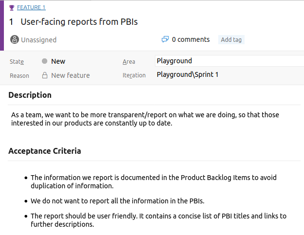
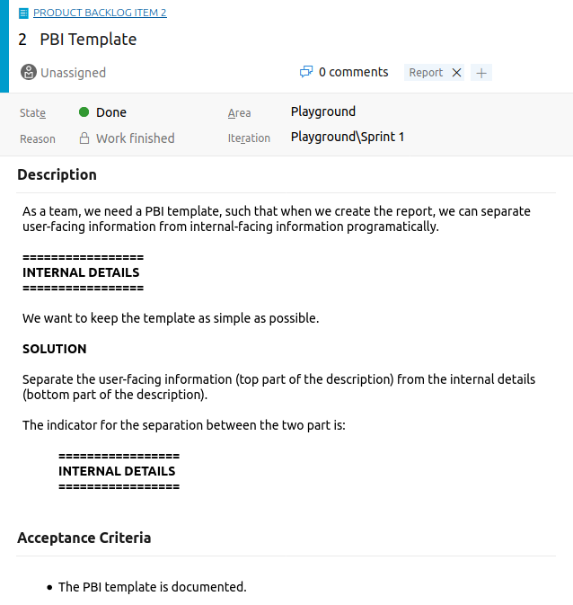
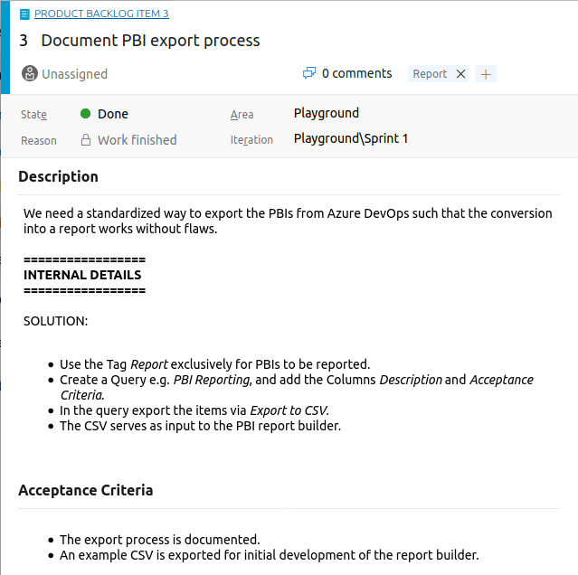
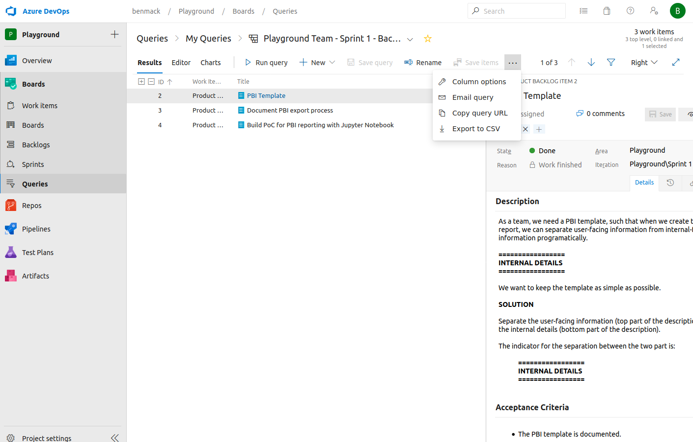

# azure-query-report

## Goal



## How does it work?

Write your PBIs according to the following template:



Export the work items to be included in the report.



Before exporting, do not forget to add columns *Tags*, *Description*, *acceptance Criteria* via the *Column options**




Use the tool in this repository to convert the CSV file into a HTMP report.

## Usage

An example CSV file exported from a query is included in this repository.

```
make_report -p ./example-az-devops-query-export.csv -o False
```

This creates two files, a Jupyter Notebook with the report including the code and HTML report:

* *./example-az-devops-query-export.ipynb*
* *./example-az-devops-query-export.html*


## Installation

Download the repository and install with pip:

```
pip install <DIRECTORY CONTAINING THE setup.py>
```
